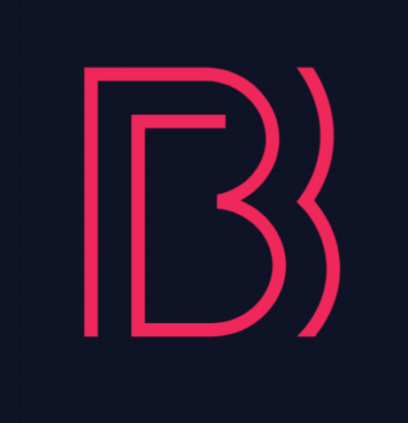

 ### Basis lets you set up your own Social VR and Networked VR games with ease.

<table border="0">
 <tr>
    <td><div align="center"></td>
    <td><div align="center"><h3><strong>Basis</strong></h3>
The Social VR Framework</br>
<a href="https://discord.gg/F35u3cUMqt"><strong>Join our Discord!»</strong></a></br></br>
<a href="https://github.com/BasisVR/Basis/issues/new?labels=bug&template=bug-report---.md">Report Bug</a> - 
<a href="https://github.com/BasisVR/Basis/issues/new?labels=enhancement&template=feature-request---.md">Request Feature</a></div></td>
 </tr>
</table>
     
 ## About Basis

[Basis Philosophy](./PHILOSOPHY.md) <- read our Philosophy here!

We are a MIT-Licensed Open-Source project with a focus on open development and full access to any optional modification desired or required.

Our goal is to help equip VR Creators, so we can accelerate the growth of VR.


We are actively working on Basis. If you like what you see please consider contributing to the github in any way you can.

 ## How you can Contribute

After a half-year of development, we have only recently put Basis on github, which that means while everything is operational, we still have to work on fixing plenty of bugs.

Do you have a suggestion for improving Basis? Please Fork the repo and create a pull request! You can also open an issue with the tag “improvement”.
Not sure how to contribute but still wanting to help out? Consider donating! We appreciate any help possible.

<noscript><a href="https://liberapay.com/dooly/donate"></a></noscript> [Github Sponsor](https://github.com/sponsors/dooly123)</br>[KoFi](https://ko-fi.com/dooly)</br>

Please help shape the future of Basis and leave your mark on its foundation. 

 #### Creating a Fork

1. Fork the Project
2. Create your Feature Branch (`git checkout -b feature/ACrazyNewFeature`)
3. Commit your Changes (`git commit -m 'Add some ACrazyNewFeature'`)
4. Push to the Branch (`git push origin feature/ACrazyNewFeature`)
5. Open a Pull Request

 ## Installation
 
This project is currently using Unity 6 (6000.0.31f1)
Other Unity versions may work but will require changes and adaptations.
Currently, only OPENXR and SteamVR are supported.

1. Make sure you have the correct Unity version installed.
2. Clone the repository
   ```sh
   git clone https://github.com/dooly123/Basis.git
   ```
3. Open the project and make sure to load the scene Initialization
4. Enter play!

 ## Contact

Luke Dooly - [@lukedooly](https://x.com/lukedooly) - doolanl208@gmail.com

Discord:</br>
[Our Discord Community](https://discord.gg/F35u3cUMqt)</br>
[Doolys Discord Account](https://discord.com/users/170859544782700544)

Thank you to everyone who has helped Basis become something remarkable.

 ## License

Distributed under the MIT License. See [MIT License](https://opensource.org/licenses/MIT) for more information.

 ### Built With

This would not be possible without the following:
- [OdinSerializer](https://github.com/TeamSirenix/odin-serializer)
- [ULipSync](https://github.com/hecomi/uLipSync)
- [UnityJigglePhysics](https://github.com/naelstrof/UnityJigglePhysics)
- [UnityOpus](https://github.com/TyounanMOTI/UnityOpus)
- [Settings Manager](https://assetstore.unity.com/packages/tools/gui/settings-manager-158458)
- [Steam Audio](https://github.com/ValveSoftware/steam-audio)
- [Kevin Iglesias Animations](https://www.keviniglesias.com/)
- [audiolink](https://github.com/llealloo/audiolink/)
- [Unity Starter Assets - ThirdPerson](https://assetstore.unity.com/packages/essentials/starter-assets-thirdperson-updates-in-new-charactercontroller-pa-196526)
- [Aurellia](https://github.com/CascadianVR) Assets\third_party\Avatar\Aurellia\LICENSE
- [YUN](https://github.com/yewnyx) Assets\third_party\Avatar\Yun\LICENSE
- [lilToon](https://github.com/lilxyzw/lilToon)
- [RNNoise](https://github.com/xiph/rnnoise?tab=BSD-3-Clause-1-ov-file)
- [RNNoise.Net](https://github.com/Yellow-Dog-Man/RNNoise.Net)
- [unity](https://unity.com/)
- [ionic icons](https://github.com/ionic-team/ionicons?ref=svgrepo.com)


## Third-Party Code and Trademarks

This project includes third-party copyright

libopus 1.2.1
Copyright 2001-2011 Xiph.Org, Skype Limited, Octasic, Jean-Marc Valin, Timothy B. Terriberry, CSIRO, Gregory Maxwell, Mark Borgerding, Erik de Castro Lopo

This project includes third-party code licensed under the Apache License 2.0:

- [SteamAudio](https://github.com/ValveSoftware/steam-audio)

This project includes third-party code licensed under the BSD-3-Clause license:
- [OpenVR](https://github.com/valvesoftware/openvr)
The OpenVR API is (C) Valve Corporation under the BSD 3-clause license

For more details, see `Basis/Assets/third_party/plugins/SteamAudio/LICENSE`.
For more details, see `Basis/Assets/third_party/plugins/SteamVR/LICENSE`.

This project also includes third-party trademarks as described in `Basis/Assets/third_party/plugins/SteamAudio/TRADEMARK_RIGHTS.md`. For more details, see `Basis/Assets/third_party/plugins/SteamAudio/TRADEMARK_RIGHTS.md`.

"Valve", "Steam", and the associated figurative images are trademarks and/or registered trademarks of Valve Corporation in the US and in various other jurisdictions. All rights reserved. Use of these trademarks must comply with the guidelines set forth in `Basis/Assets/third_party/plugins/SteamAudio/TRADEMARK_RIGHTS.md`.
